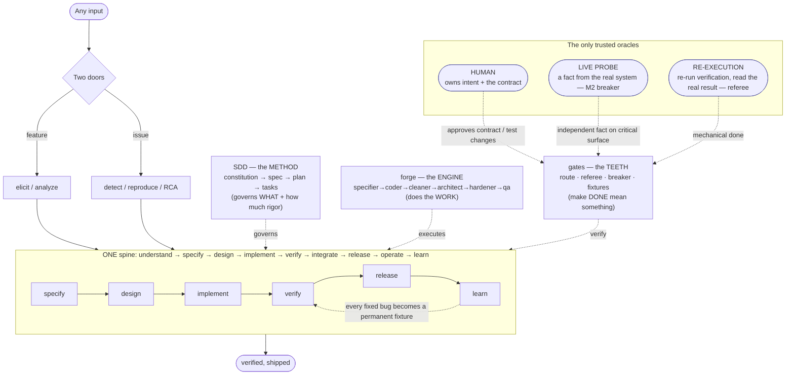
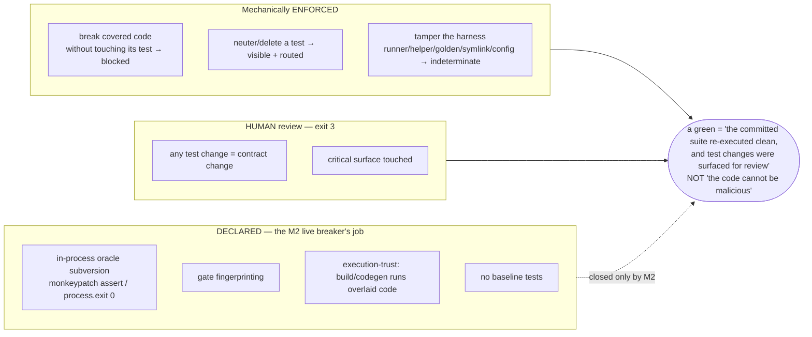

# The Ideal Tool — architecture, trust model & honest state (v1)

> A conceptual companion to `process-diagram.v1.md` (which shows the end-to-end *flow*). This shows
> **what the tool IS** (one spine, three layers, three oracles), **what the gate actually does** to a
> change, and **the honest state** after the M0 rebuild + hardening. Versioning: never overwrite → `.v2`.

## 1. One spine, three layers, three oracles



**Read it:** any input enters by one of two doors, then travels a single lifecycle spine. Three layers
act on that spine — **SDD** decides *what* and *how much rigor*, **forge** does the work, **gates** make
"done" real. Trust never rests on an LLM's self-report: only the **human** (intent/contract), a **live
probe** (fact), and **re-execution** (mechanical done) are believed. "Independence ≠ another LLM."

## 2. What a change actually goes through (the gate we built)

```mermaid
flowchart TD
  C([committed change: base..head]) --> RT["route.mjs — deterministic tier<br/>diff base..head · config from base ref"]
  RT --> RF

  subgraph RF ["referee.mjs — verify by re-execution"]
    PRE{"preconditions:<br/>every changed path is<br/>production / declared-test / manifest?"}
    PRE -->|no| IND2>"exit 2 — indeterminate<br/>(declare it / ambiguous / symlink / collision)"]
    PRE -->|yes| OV["build trusted tree:<br/>FULL BASE + overlay head PRODUCTION<br/>(+ the PR's modified tests — Option B)"]
    OV --> R1["run 1: base harness × head production"]
    OV --> R2["run 2: head as-is"]
    OV --> R3["acceptance oracle (optional, independent)"]
    R1 --> INTEG{"both green + harness unmutated?"}
    R2 --> INTEG
    R3 --> INTEG
  end

  INTEG -->|no, broke covered code| F>"exit 1 — blocked (mechanical)"]
  INTEG -->|yes| Q{"critical surface<br/>OR a test was changed?"}
  Q -->|no| PASS>"exit 0 — verified green"]
  Q -->|yes| REV>"exit 3 — needs human / M2 breaker review"]

  classDef bad fill:#fdd,stroke:#c33; classDef ok fill:#dfd,stroke:#3a3; classDef warn fill:#ffd,stroke:#ca3;
  class F,IND2 bad; class PASS ok; class REV warn;
```

## 3. The honest verdict boundary (what a green means)



## 4. Build state (honest)

```mermaid
flowchart LR
  M0["M0 · make green real<br/>referee + red-team"]:::done --> M1["M1 · deterministic routing<br/>route.mjs"]:::done
  M1 --> M2["M2 · live breaker + dogfood 1 issue<br/>PROVE-OR-KILL"]:::next
  M2 --> M3["M3 · depth + metrics"]:::todo
  M3 --> M4["M4 · SDD-native"]:::todo --> M5["M5 · scale/targets"]:::todo --> M6["M6 · consolidation/UX"]:::todo
  classDef done fill:#dfd,stroke:#3a3; classDef next fill:#ffd,stroke:#ca3; classDef todo fill:#eee,stroke:#999;
```

- **M0 / M1 — done, hardened by execution** (breaker score 25 → converged; every attack a regression test).
- **M2 — next, and the critical one:** the **live breaker** is the only thing that closes the declared
  limits in §3; it is also the **prove-or-kill** dogfood (one real issue end-to-end, cost measured).
- **M3–M6 — designed (frozen docs), not started.**
