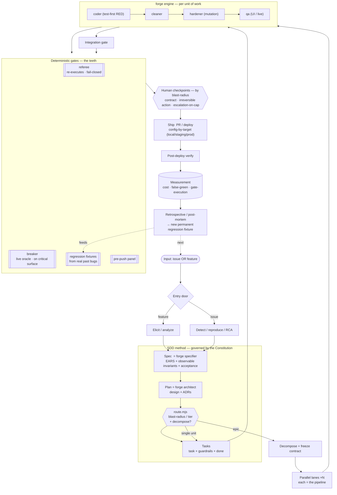

# Final Process Diagram — v1 (FROZEN)

> **Status:** FROZEN reference. The end-state (M6) flow of the harness: SDD is the method,
> forge is the engine, the deterministic gates are the teeth. **Versioning:** never overwrite → `.v2`.



**How to read it:** one door for any input → the SDD spine (governed by the Constitution)
defines *what* and routes *how much rigor* → forge runs the per-unit pipeline (an epic fans
out into parallel lanes + an integration gate) → the deterministic gates make "done" real →
the human is touched only at blast-radius checkpoints → ship (config-by-target) → measure →
learn, and every fixed bug becomes a permanent fixture that feeds the gates.

> We are currently building the **`referee`** node (M0) — the first tooth. Everything else
> is designed (frozen v1 docs) and built in order M0→M6.
```
